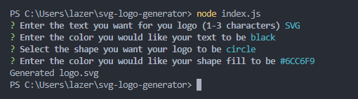

# SVG-Logo-Generator

## Description

This project was made to practice object oriented programming and using jest to test my code.
This project creates a SVG image after taking in user input
This project taught me how to import classes from another file, jest to test class function, object oriented programming and how SVG's work

## Usage

User will be prompted a series of questions, first asking for the logo text which has to be 1-3 characters, the color of the text, what shape you would like for the logo and what color that shape should be. The SVG logo is set to 300x200.

This is what is generated based on the prompts and answers given above

Video Walkthrough: https://youtu.be/qZcSUDughQI
GitHub Repo URL: https://github.com/TimeBytes/SVG-Logo-Generator

## Credit

This link helped me with SVGs
https://developer.mozilla.org/en-US/docs/Web/SVG/Tutorial/Basic_Shapes

## License

MIT License
